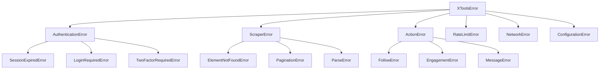

# Error Handling

Comprehensive guide to handling errors in XTools, including the exception hierarchy, retry strategies, and best practices.

!!! note "Educational Purpose"
    This documentation is for educational purposes only. Always respect platform terms of service.

## Exception Hierarchy

XTools uses a structured exception hierarchy for precise error handling:



## Exception Reference

### Base Exception

```python
class XToolsError(Exception):
    """Base exception for all XTools errors."""
    
    def __init__(self, message: str, details: dict = None):
        self.message = message
        self.details = details or {}
        super().__init__(message)
```

### Authentication Errors

| Exception | Cause | Solution |
|-----------|-------|----------|
| `AuthenticationError` | General auth failure | Re-authenticate |
| `SessionExpiredError` | Cookies expired | Load fresh session |
| `LoginRequiredError` | Not logged in | Call `auth.login()` |
| `TwoFactorRequiredError` | 2FA needed | Complete 2FA flow |

```python
from xtools.core.exceptions import (
    AuthenticationError,
    SessionExpiredError,
    LoginRequiredError
)

async with XTools() as x:
    try:
        await x.auth.load_session("session.json")
    except SessionExpiredError:
        print("Session expired, logging in again...")
        await x.auth.login()
        await x.auth.save_session("session.json")
    except LoginRequiredError:
        print("No valid session, please log in")
        await x.auth.login()
```

### Scraper Errors

| Exception | Cause | Solution |
|-----------|-------|----------|
| `ScraperError` | General scraping failure | Check URL/params |
| `ElementNotFoundError` | DOM element missing | Page structure changed |
| `PaginationError` | Pagination failed | Retry or reset cursor |
| `ParseError` | Data parsing failed | Check data format |

```python
from xtools.core.exceptions import (
    ScraperError,
    ElementNotFoundError,
    ParseError
)

async with XTools() as x:
    try:
        result = await x.scrape.replies(tweet_url)
    except ElementNotFoundError as e:
        print(f"Page structure may have changed: {e}")
    except ParseError as e:
        print(f"Could not parse response: {e}")
    except ScraperError as e:
        print(f"Scraping failed: {e}")
```

### Action Errors

| Exception | Cause | Solution |
|-----------|-------|----------|
| `ActionError` | General action failure | Check permissions |
| `FollowError` | Follow/unfollow failed | May be blocked |
| `EngagementError` | Like/retweet failed | Check tweet status |
| `MessageError` | DM failed | Check DM settings |

```python
from xtools.core.exceptions import FollowError, EngagementError

async with XTools() as x:
    try:
        await x.follow.user("targetuser")
    except FollowError as e:
        if "blocked" in str(e).lower():
            print("You may be blocked by this user")
        elif "limit" in str(e).lower():
            print("Follow limit reached")
```

### Rate Limit Errors

```python
from xtools.core.exceptions import RateLimitError

class RateLimitError(XToolsError):
    """Raised when rate limited by the platform."""
    
    def __init__(self, message: str, retry_after: int = None):
        super().__init__(message)
        self.retry_after = retry_after  # Seconds to wait
```

**Handling:**

```python
import asyncio

async with XTools() as x:
    try:
        result = await x.scrape.followers("username", limit=5000)
    except RateLimitError as e:
        wait_time = e.retry_after or 900  # Default 15 min
        print(f"Rate limited. Waiting {wait_time}s...")
        await asyncio.sleep(wait_time)
        # Retry
        result = await x.scrape.followers("username", limit=5000)
```

### Network Errors

| Exception | Cause | Solution |
|-----------|-------|----------|
| `NetworkError` | Connection issue | Check internet |
| `TimeoutError` | Request timed out | Increase timeout |

## Retry Strategies

### Simple Retry with Exponential Backoff

```python
import asyncio
from xtools.core.exceptions import RateLimitError, NetworkError

async def retry_with_backoff(
    coro_func,
    *args,
    max_retries: int = 3,
    base_delay: float = 1.0,
    max_delay: float = 60.0,
    **kwargs
):
    """Execute coroutine with exponential backoff retry."""
    
    last_error = None
    
    for attempt in range(max_retries):
        try:
            return await coro_func(*args, **kwargs)
            
        except RateLimitError as e:
            wait_time = e.retry_after or min(
                base_delay * (2 ** attempt),
                max_delay
            )
            print(f"Rate limited. Attempt {attempt + 1}/{max_retries}. "
                  f"Waiting {wait_time}s...")
            await asyncio.sleep(wait_time)
            last_error = e
            
        except NetworkError as e:
            wait_time = min(base_delay * (2 ** attempt), max_delay)
            print(f"Network error. Attempt {attempt + 1}/{max_retries}. "
                  f"Waiting {wait_time}s...")
            await asyncio.sleep(wait_time)
            last_error = e
            
        except Exception as e:
            # Don't retry other errors
            raise
    
    raise last_error

# Usage
async with XTools() as x:
    result = await retry_with_backoff(
        x.scrape.followers,
        "username",
        limit=1000,
        max_retries=5
    )
```

### Retry Decorator

```python
from functools import wraps
import asyncio
import random

def async_retry(
    max_retries: int = 3,
    exceptions: tuple = (RateLimitError, NetworkError),
    base_delay: float = 1.0,
    jitter: bool = True
):
    """Decorator for async retry with exponential backoff."""
    
    def decorator(func):
        @wraps(func)
        async def wrapper(*args, **kwargs):
            for attempt in range(max_retries):
                try:
                    return await func(*args, **kwargs)
                except exceptions as e:
                    if attempt == max_retries - 1:
                        raise
                    
                    delay = base_delay * (2 ** attempt)
                    if jitter:
                        delay += random.uniform(0, delay * 0.1)
                    
                    if isinstance(e, RateLimitError) and e.retry_after:
                        delay = e.retry_after
                    
                    await asyncio.sleep(delay)
            
        return wrapper
    return decorator

# Usage
@async_retry(max_retries=5, base_delay=2.0)
async def scrape_with_retry(x, username):
    return await x.scrape.followers(username, limit=1000)
```

## Circuit Breaker Pattern

Prevent cascading failures with a circuit breaker:

```python
import asyncio
from datetime import datetime, timedelta
from enum import Enum

class CircuitState(Enum):
    CLOSED = "closed"      # Normal operation
    OPEN = "open"          # Failing, reject requests
    HALF_OPEN = "half_open"  # Testing recovery

class CircuitBreaker:
    """Circuit breaker for XTools operations."""
    
    def __init__(
        self,
        failure_threshold: int = 5,
        recovery_timeout: float = 60.0,
        success_threshold: int = 2
    ):
        self.failure_threshold = failure_threshold
        self.recovery_timeout = recovery_timeout
        self.success_threshold = success_threshold
        
        self.state = CircuitState.CLOSED
        self.failure_count = 0
        self.success_count = 0
        self.last_failure_time = None
    
    async def call(self, coro_func, *args, **kwargs):
        """Execute function through circuit breaker."""
        
        if self.state == CircuitState.OPEN:
            if self._should_attempt_recovery():
                self.state = CircuitState.HALF_OPEN
            else:
                raise CircuitBreakerOpenError(
                    f"Circuit breaker open. Retry after "
                    f"{self._time_until_recovery()}s"
                )
        
        try:
            result = await coro_func(*args, **kwargs)
            self._on_success()
            return result
            
        except Exception as e:
            self._on_failure()
            raise
    
    def _on_success(self):
        if self.state == CircuitState.HALF_OPEN:
            self.success_count += 1
            if self.success_count >= self.success_threshold:
                self.state = CircuitState.CLOSED
                self.failure_count = 0
                self.success_count = 0
        else:
            self.failure_count = 0
    
    def _on_failure(self):
        self.failure_count += 1
        self.last_failure_time = datetime.utcnow()
        self.success_count = 0
        
        if self.failure_count >= self.failure_threshold:
            self.state = CircuitState.OPEN
    
    def _should_attempt_recovery(self) -> bool:
        if self.last_failure_time is None:
            return True
        elapsed = (datetime.utcnow() - self.last_failure_time).total_seconds()
        return elapsed >= self.recovery_timeout
    
    def _time_until_recovery(self) -> float:
        if self.last_failure_time is None:
            return 0
        elapsed = (datetime.utcnow() - self.last_failure_time).total_seconds()
        return max(0, self.recovery_timeout - elapsed)

class CircuitBreakerOpenError(Exception):
    pass

# Usage
circuit = CircuitBreaker(failure_threshold=3, recovery_timeout=120)

async with XTools() as x:
    try:
        result = await circuit.call(x.scrape.followers, "username")
    except CircuitBreakerOpenError as e:
        print(f"Service unavailable: {e}")
```

## Graceful Degradation

Handle failures gracefully with fallbacks:

```python
from typing import Optional, TypeVar, Callable, Any
from dataclasses import dataclass

T = TypeVar('T')

@dataclass
class FallbackResult:
    data: Any
    is_fallback: bool
    error: Optional[Exception] = None

async def with_fallback(
    primary: Callable,
    fallback: Callable,
    *args,
    **kwargs
) -> FallbackResult:
    """Execute with fallback on failure."""
    
    try:
        result = await primary(*args, **kwargs)
        return FallbackResult(data=result, is_fallback=False)
    except Exception as e:
        try:
            fallback_result = await fallback(*args, **kwargs)
            return FallbackResult(
                data=fallback_result,
                is_fallback=True,
                error=e
            )
        except Exception:
            raise e  # Re-raise original if fallback also fails

# Example: Fall back to cached data
async def get_followers_with_cache(x, username: str, cache: dict):
    async def primary():
        return await x.scrape.followers(username, limit=100)
    
    async def fallback():
        if username in cache:
            return cache[username]
        raise KeyError(f"No cache for {username}")
    
    result = await with_fallback(primary, fallback)
    
    if result.is_fallback:
        print(f"Using cached data due to: {result.error}")
    else:
        cache[username] = result.data
    
    return result.data
```

## Logging Best Practices

```python
import logging
from xtools.core.exceptions import XToolsError

# Configure logging
logging.basicConfig(
    level=logging.INFO,
    format='%(asctime)s - %(name)s - %(levelname)s - %(message)s',
    handlers=[
        logging.FileHandler('xtools.log'),
        logging.StreamHandler()
    ]
)

logger = logging.getLogger('xtools')

async def scrape_with_logging(x, username: str):
    """Scrape with comprehensive logging."""
    
    logger.info(f"Starting follower scrape for @{username}")
    
    try:
        result = await x.scrape.followers(username, limit=100)
        logger.info(f"Scraped {len(result.items)} followers for @{username}")
        return result
        
    except RateLimitError as e:
        logger.warning(
            f"Rate limited while scraping @{username}",
            extra={
                "retry_after": e.retry_after,
                "username": username
            }
        )
        raise
        
    except ScraperError as e:
        logger.error(
            f"Scraper error for @{username}: {e}",
            exc_info=True
        )
        raise
        
    except Exception as e:
        logger.critical(
            f"Unexpected error scraping @{username}",
            exc_info=True
        )
        raise
```

## Error Reporting

### Send Errors to External Services

```python
import aiohttp
from datetime import datetime

class ErrorReporter:
    """Report errors to external monitoring service."""
    
    def __init__(self, webhook_url: str, service_name: str = "xtools"):
        self.webhook_url = webhook_url
        self.service_name = service_name
    
    async def report(self, error: Exception, context: dict = None):
        """Send error report to monitoring service."""
        
        payload = {
            "service": self.service_name,
            "error_type": type(error).__name__,
            "message": str(error),
            "timestamp": datetime.utcnow().isoformat(),
            "context": context or {}
        }
        
        if hasattr(error, 'details'):
            payload["details"] = error.details
        
        try:
            async with aiohttp.ClientSession() as session:
                await session.post(self.webhook_url, json=payload)
        except Exception:
            pass  # Don't fail on reporting errors

# Usage
reporter = ErrorReporter("https://monitoring.example.com/errors")

async with XTools() as x:
    try:
        await x.scrape.followers("username")
    except XToolsError as e:
        await reporter.report(e, {"operation": "scrape_followers"})
        raise
```

### Sentry Integration

```python
import sentry_sdk
from sentry_sdk.integrations.asyncio import AsyncioIntegration

# Initialize Sentry
sentry_sdk.init(
    dsn="https://your-sentry-dsn",
    integrations=[AsyncioIntegration()],
    traces_sample_rate=0.1
)

async with XTools() as x:
    try:
        await x.scrape.followers("username")
    except Exception as e:
        sentry_sdk.capture_exception(e)
        raise
```

## Complete Error Handling Example

```python
import asyncio
import logging
from xtools import XTools
from xtools.core.exceptions import (
    XToolsError,
    RateLimitError,
    AuthenticationError,
    ScraperError,
    NetworkError
)

logging.basicConfig(level=logging.INFO)
logger = logging.getLogger(__name__)

async def robust_scraping(username: str, limit: int = 100):
    """Production-ready scraping with full error handling."""
    
    circuit = CircuitBreaker(failure_threshold=3)
    max_retries = 3
    
    for attempt in range(max_retries):
        try:
            async with XTools() as x:
                await x.auth.load_session("session.json")
                
                result = await circuit.call(
                    x.scrape.followers,
                    username,
                    limit=limit
                )
                
                logger.info(f"Successfully scraped {len(result.items)} followers")
                return result
                
        except AuthenticationError:
            logger.error("Authentication failed")
            raise  # Don't retry auth errors
            
        except RateLimitError as e:
            wait_time = e.retry_after or 60 * (attempt + 1)
            logger.warning(f"Rate limited. Waiting {wait_time}s...")
            await asyncio.sleep(wait_time)
            
        except NetworkError as e:
            logger.warning(f"Network error: {e}. Retrying...")
            await asyncio.sleep(5 * (attempt + 1))
            
        except CircuitBreakerOpenError:
            logger.error("Service temporarily unavailable")
            raise
            
        except ScraperError as e:
            logger.error(f"Scraper error: {e}")
            if attempt == max_retries - 1:
                raise
    
    raise ScraperError(f"Failed after {max_retries} attempts")

if __name__ == "__main__":
    asyncio.run(robust_scraping("elonmusk", limit=100))
```

## Next Steps

- [Plugins](plugins.md) - Handle errors in plugins
- [Webhooks](webhooks.md) - Send error notifications
- [Testing](testing.md) - Test error handling
