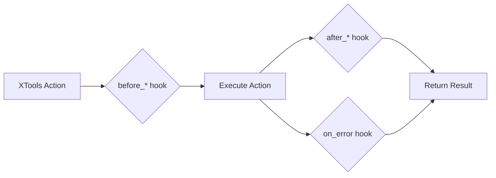

# Plugin System

Extend XTools functionality with a powerful plugin system. Create reusable plugins for logging, metrics, notifications, and custom behaviors.

!!! note "Educational Purpose"
    This documentation is for educational purposes only. Always respect platform terms of service.

## Plugin Architecture

Plugins hook into XTools' lifecycle events to add functionality without modifying core code.



## Plugin Interface

All plugins inherit from the `Plugin` base class:

```python
from xtools.core.plugins import Plugin
from typing import Any, Optional

class Plugin:
    """Base class for XTools plugins."""
    
    name: str = "base_plugin"
    version: str = "1.0.0"
    description: str = ""
    
    def on_init(self, xtools: "XTools") -> None:
        """Called when plugin is registered."""
        pass
    
    def on_shutdown(self, xtools: "XTools") -> None:
        """Called when XTools context exits."""
        pass
    
    async def before_scrape(self, scraper_name: str, **kwargs) -> None:
        """Called before any scrape operation."""
        pass
    
    async def after_scrape(self, scraper_name: str, result: Any, **kwargs) -> Any:
        """Called after scrape completes. Can modify result."""
        return result
    
    async def before_action(self, action_name: str, **kwargs) -> None:
        """Called before any action (follow, like, etc.)."""
        pass
    
    async def after_action(self, action_name: str, result: Any, **kwargs) -> Any:
        """Called after action completes."""
        return result
    
    async def on_error(self, error: Exception, context: dict) -> Optional[Exception]:
        """Called when an error occurs. Return None to suppress."""
        return error
    
    async def on_rate_limit(self, wait_time: float, context: dict) -> float:
        """Called when rate limited. Return adjusted wait time."""
        return wait_time
```

## Creating a Plugin

### Basic Logging Plugin

```python
from xtools.core.plugins import Plugin
import logging
from datetime import datetime

class LoggingPlugin(Plugin):
    """Plugin that logs all XTools operations."""
    
    name = "logging"
    version = "1.0.0"
    description = "Comprehensive logging for all operations"
    
    def __init__(self, log_level: int = logging.INFO, log_file: str = None):
        self.logger = logging.getLogger("xtools.plugin.logging")
        self.logger.setLevel(log_level)
        
        if log_file:
            handler = logging.FileHandler(log_file)
            handler.setFormatter(logging.Formatter(
                '%(asctime)s - %(levelname)s - %(message)s'
            ))
            self.logger.addHandler(handler)
    
    def on_init(self, xtools):
        self.logger.info(f"XTools initialized with {len(xtools.plugins)} plugins")
    
    async def before_scrape(self, scraper_name: str, **kwargs):
        self.logger.info(f"Starting scrape: {scraper_name} with {kwargs}")
    
    async def after_scrape(self, scraper_name: str, result, **kwargs):
        count = len(result.items) if hasattr(result, 'items') else 'N/A'
        self.logger.info(f"Completed scrape: {scraper_name}, items: {count}")
        return result
    
    async def before_action(self, action_name: str, **kwargs):
        self.logger.info(f"Starting action: {action_name}")
    
    async def after_action(self, action_name: str, result, **kwargs):
        self.logger.info(f"Completed action: {action_name}, success: {result}")
        return result
    
    async def on_error(self, error: Exception, context: dict):
        self.logger.error(f"Error in {context.get('operation')}: {error}")
        return error
    
    async def on_rate_limit(self, wait_time: float, context: dict):
        self.logger.warning(f"Rate limited, waiting {wait_time}s")
        return wait_time
```

### Metrics Plugin

```python
from xtools.core.plugins import Plugin
from dataclasses import dataclass, field
from datetime import datetime
from typing import Dict, List
import json

@dataclass
class OperationMetric:
    operation: str
    start_time: datetime
    end_time: datetime = None
    success: bool = True
    error: str = None
    
    @property
    def duration(self) -> float:
        if self.end_time:
            return (self.end_time - self.start_time).total_seconds()
        return 0

class MetricsPlugin(Plugin):
    """Collect and export operation metrics."""
    
    name = "metrics"
    version = "1.0.0"
    
    def __init__(self):
        self.metrics: List[OperationMetric] = []
        self.active_operations: Dict[str, OperationMetric] = {}
        self.counters = {
            "scrapes": 0,
            "actions": 0,
            "errors": 0,
            "rate_limits": 0
        }
    
    def on_init(self, xtools):
        self.start_time = datetime.utcnow()
    
    async def before_scrape(self, scraper_name: str, **kwargs):
        op_id = f"scrape_{scraper_name}_{datetime.utcnow().timestamp()}"
        self.active_operations[op_id] = OperationMetric(
            operation=f"scrape:{scraper_name}",
            start_time=datetime.utcnow()
        )
        self.counters["scrapes"] += 1
        return op_id
    
    async def after_scrape(self, scraper_name: str, result, **kwargs):
        # Find and complete the metric
        for op_id, metric in list(self.active_operations.items()):
            if metric.operation == f"scrape:{scraper_name}":
                metric.end_time = datetime.utcnow()
                self.metrics.append(metric)
                del self.active_operations[op_id]
                break
        return result
    
    async def before_action(self, action_name: str, **kwargs):
        self.counters["actions"] += 1
    
    async def on_error(self, error: Exception, context: dict):
        self.counters["errors"] += 1
        return error
    
    async def on_rate_limit(self, wait_time: float, context: dict):
        self.counters["rate_limits"] += 1
        return wait_time
    
    def get_summary(self) -> dict:
        """Get metrics summary."""
        durations = [m.duration for m in self.metrics if m.duration > 0]
        return {
            "total_operations": len(self.metrics),
            "counters": self.counters,
            "avg_duration": sum(durations) / len(durations) if durations else 0,
            "total_runtime": (datetime.utcnow() - self.start_time).total_seconds()
        }
    
    def export_json(self, filepath: str):
        """Export metrics to JSON."""
        data = {
            "summary": self.get_summary(),
            "operations": [
                {
                    "operation": m.operation,
                    "duration": m.duration,
                    "success": m.success,
                    "error": m.error
                }
                for m in self.metrics
            ]
        }
        with open(filepath, "w") as f:
            json.dump(data, f, indent=2, default=str)
```

### Notification Plugin

```python
from xtools.core.plugins import Plugin
import aiohttp
from typing import List, Optional

class DiscordNotificationPlugin(Plugin):
    """Send notifications to Discord on events."""
    
    name = "discord_notifications"
    version = "1.0.0"
    
    def __init__(
        self,
        webhook_url: str,
        notify_on: List[str] = None,
        mention_on_error: str = None
    ):
        self.webhook_url = webhook_url
        self.notify_on = notify_on or ["error", "rate_limit", "milestone"]
        self.mention_on_error = mention_on_error
        self.items_scraped = 0
        self.milestone_threshold = 1000
    
    async def _send_discord(self, content: str, embed: dict = None):
        """Send message to Discord webhook."""
        payload = {"content": content}
        if embed:
            payload["embeds"] = [embed]
        
        async with aiohttp.ClientSession() as session:
            await session.post(self.webhook_url, json=payload)
    
    async def after_scrape(self, scraper_name: str, result, **kwargs):
        if hasattr(result, 'items'):
            self.items_scraped += len(result.items)
            
            # Check for milestone
            if "milestone" in self.notify_on:
                if self.items_scraped >= self.milestone_threshold:
                    await self._send_discord(
                        f"🎉 Milestone reached: {self.items_scraped} items scraped!"
                    )
                    self.milestone_threshold += 1000
        return result
    
    async def on_error(self, error: Exception, context: dict):
        if "error" in self.notify_on:
            mention = f"{self.mention_on_error} " if self.mention_on_error else ""
            await self._send_discord(
                f"{mention}❌ Error in XTools",
                embed={
                    "title": "Error Occurred",
                    "description": str(error),
                    "color": 15158332,  # Red
                    "fields": [
                        {"name": "Operation", "value": context.get("operation", "Unknown")}
                    ]
                }
            )
        return error
    
    async def on_rate_limit(self, wait_time: float, context: dict):
        if "rate_limit" in self.notify_on:
            await self._send_discord(
                f"⏳ Rate limited for {wait_time:.0f} seconds"
            )
        return wait_time
```

## Using Plugins

### Registration

```python
from xtools import XTools
from my_plugins import LoggingPlugin, MetricsPlugin, DiscordNotificationPlugin

# Method 1: Register on class
XTools.use(LoggingPlugin(log_file="xtools.log"))
XTools.use(MetricsPlugin())

# Method 2: Register on instance
async with XTools() as x:
    x.use(DiscordNotificationPlugin(
        webhook_url="https://discord.com/api/webhooks/...",
        notify_on=["error", "milestone"]
    ))
    
    # Now all operations will trigger plugin hooks
    await x.scrape.followers("username", limit=100)
```

### Plugin Configuration

```python
from xtools import XTools
from xtools.core.config import Config

# Configure plugins via config
config = Config(
    plugins={
        "logging": {
            "enabled": True,
            "level": "DEBUG",
            "file": "xtools.log"
        },
        "metrics": {
            "enabled": True,
            "export_on_shutdown": True,
            "export_path": "metrics.json"
        },
        "discord": {
            "enabled": True,
            "webhook_url": "${DISCORD_WEBHOOK_URL}",
            "notify_on": ["error"]
        }
    }
)

async with XTools(config=config) as x:
    # Plugins auto-loaded from config
    await x.scrape.tweets("username")
```

### Accessing Plugin Data

```python
async with XTools() as x:
    metrics = MetricsPlugin()
    x.use(metrics)
    
    await x.scrape.followers("user1", limit=100)
    await x.scrape.followers("user2", limit=100)
    
    # Access metrics
    summary = metrics.get_summary()
    print(f"Operations: {summary['total_operations']}")
    print(f"Avg duration: {summary['avg_duration']:.2f}s")
    
    # Export
    metrics.export_json("session_metrics.json")
```

## Publishing Plugins

### Package Structure

```
xtools-plugin-myfeature/
├── pyproject.toml
├── README.md
├── LICENSE
├── src/
│   └── xtools_myfeature/
│       ├── __init__.py
│       └── plugin.py
└── tests/
    └── test_plugin.py
```

### pyproject.toml

```toml
[build-system]
requires = ["setuptools>=61.0"]
build-backend = "setuptools.build_meta"

[project]
name = "xtools-plugin-myfeature"
version = "1.0.0"
description = "My awesome XTools plugin"
readme = "README.md"
requires-python = ">=3.10"
dependencies = [
    "xtools>=2.0.0",
]

[project.entry-points."xtools.plugins"]
myfeature = "xtools_myfeature:MyFeaturePlugin"

[project.urls]
Homepage = "https://github.com/user/xtools-plugin-myfeature"
```

### Auto-Discovery

XTools automatically discovers installed plugins:

```python
from xtools import XTools

# Plugin auto-discovered from entry points
async with XTools(auto_discover_plugins=True) as x:
    # myfeature plugin is already registered
    pass
```

## Example Plugins

### Rate Limit Adjuster

```python
class AdaptiveRateLimitPlugin(Plugin):
    """Dynamically adjust rate limits based on responses."""
    
    name = "adaptive_rate_limit"
    
    def __init__(self, multiplier: float = 1.5):
        self.multiplier = multiplier
        self.consecutive_rate_limits = 0
    
    async def on_rate_limit(self, wait_time: float, context: dict):
        self.consecutive_rate_limits += 1
        # Exponentially increase wait time
        adjusted = wait_time * (self.multiplier ** self.consecutive_rate_limits)
        return min(adjusted, 900)  # Cap at 15 minutes
    
    async def after_scrape(self, scraper_name: str, result, **kwargs):
        self.consecutive_rate_limits = 0  # Reset on success
        return result
```

### Data Transformer

```python
class DataCleanerPlugin(Plugin):
    """Clean and normalize scraped data."""
    
    name = "data_cleaner"
    
    async def after_scrape(self, scraper_name: str, result, **kwargs):
        if hasattr(result, 'items'):
            for item in result.items:
                # Normalize text
                if hasattr(item, 'text'):
                    item.text = self._clean_text(item.text)
                # Normalize usernames
                if hasattr(item, 'username'):
                    item.username = item.username.lower().strip('@')
        return result
    
    def _clean_text(self, text: str) -> str:
        import re
        # Remove extra whitespace
        text = re.sub(r'\s+', ' ', text)
        # Remove zero-width characters
        text = re.sub(r'[\u200b\u200c\u200d\ufeff]', '', text)
        return text.strip()
```

## Best Practices

!!! tip "Plugin Development Tips"
    1. **Keep plugins focused** - One plugin, one responsibility
    2. **Handle errors gracefully** - Don't let plugin errors crash XTools
    3. **Use async properly** - All hooks are async, use await
    4. **Document configuration** - Make options clear
    5. **Version your plugins** - Follow semver for compatibility

!!! warning "Performance"
    Plugins run on every operation. Keep hook implementations fast to avoid slowing down XTools.

## Next Steps

- [Custom Scrapers](custom-scrapers.md) - Build custom scrapers
- [Error Handling](errors.md) - Handle errors in plugins
- [Webhooks](webhooks.md) - Advanced webhook integration
