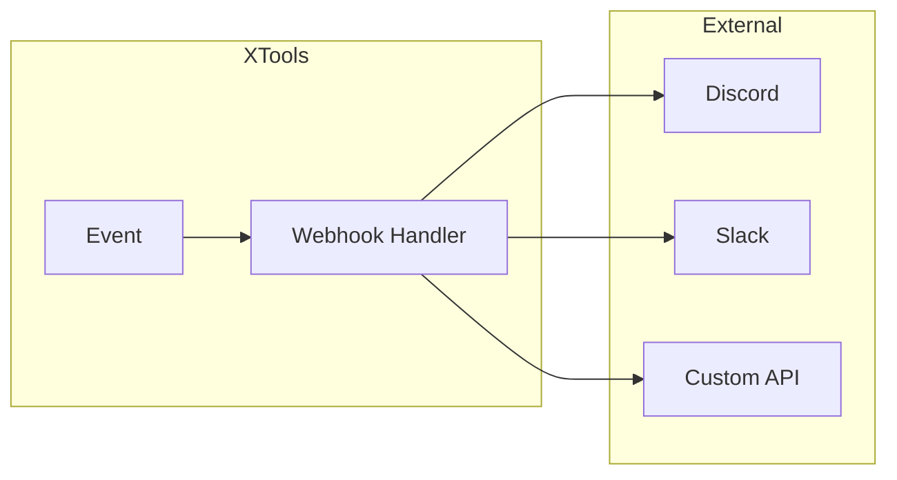

# Webhook Integration

Integrate XTools with external services using webhooks. Send notifications, receive triggers, and build event-driven automation.

!!! note "Educational Purpose"
    This documentation is for educational purposes only. Always respect platform terms of service.

## Overview

Webhooks enable real-time communication between XTools and external services:

- **Outgoing webhooks**: XTools sends data to external URLs on events
- **Incoming webhooks**: External services trigger XTools actions



## Outgoing Webhooks

### Basic Webhook Client

```python
import aiohttp
import hashlib
import hmac
import json
from datetime import datetime
from typing import Optional, Dict, Any, List

class WebhookClient:
    """Send webhooks to external services."""
    
    def __init__(
        self,
        url: str,
        secret: Optional[str] = None,
        headers: Optional[Dict[str, str]] = None
    ):
        self.url = url
        self.secret = secret
        self.headers = headers or {}
        self.retry_count = 3
        self.retry_delay = 1.0
    
    def _sign_payload(self, payload: bytes) -> str:
        """Create HMAC signature for payload."""
        if not self.secret:
            return ""
        return hmac.new(
            self.secret.encode(),
            payload,
            hashlib.sha256
        ).hexdigest()
    
    async def send(
        self,
        event: str,
        data: Dict[str, Any]
    ) -> bool:
        """Send webhook with retry logic."""
        
        payload = {
            "event": event,
            "timestamp": datetime.utcnow().isoformat(),
            "data": data
        }
        
        payload_bytes = json.dumps(payload).encode()
        
        headers = {
            "Content-Type": "application/json",
            **self.headers
        }
        
        if self.secret:
            headers["X-Signature"] = self._sign_payload(payload_bytes)
        
        for attempt in range(self.retry_count):
            try:
                async with aiohttp.ClientSession() as session:
                    async with session.post(
                        self.url,
                        data=payload_bytes,
                        headers=headers,
                        timeout=aiohttp.ClientTimeout(total=10)
                    ) as response:
                        if response.status < 400:
                            return True
                        
                        if response.status >= 500:
                            # Server error, retry
                            await asyncio.sleep(self.retry_delay * (attempt + 1))
                            continue
                        
                        # Client error, don't retry
                        return False
                        
            except Exception as e:
                if attempt == self.retry_count - 1:
                    raise
                await asyncio.sleep(self.retry_delay * (attempt + 1))
        
        return False
```

### Event-Driven Webhooks

```python
from xtools.core.plugins import Plugin
from enum import Enum

class WebhookEvent(Enum):
    SCRAPE_COMPLETE = "scrape.complete"
    SCRAPE_ERROR = "scrape.error"
    ACTION_COMPLETE = "action.complete"
    ACTION_ERROR = "action.error"
    RATE_LIMIT = "rate_limit"
    MILESTONE = "milestone"
    UNFOLLOWER_DETECTED = "unfollower.detected"

class WebhookPlugin(Plugin):
    """Plugin to send webhooks on XTools events."""
    
    name = "webhooks"
    version = "1.0.0"
    
    def __init__(
        self,
        webhooks: List[Dict[str, Any]],
        events: List[WebhookEvent] = None
    ):
        """
        Initialize webhook plugin.
        
        Args:
            webhooks: List of webhook configs with 'url' and optional 'secret'
            events: Events to send webhooks for (all if None)
        """
        self.clients = [
            WebhookClient(
                url=w["url"],
                secret=w.get("secret"),
                headers=w.get("headers")
            )
            for w in webhooks
        ]
        self.events = events or list(WebhookEvent)
        self.stats = {"sent": 0, "failed": 0}
    
    async def _send_all(self, event: WebhookEvent, data: dict):
        """Send to all configured webhooks."""
        if event not in self.events:
            return
        
        for client in self.clients:
            try:
                success = await client.send(event.value, data)
                if success:
                    self.stats["sent"] += 1
                else:
                    self.stats["failed"] += 1
            except Exception as e:
                self.stats["failed"] += 1
    
    async def after_scrape(self, scraper_name: str, result, **kwargs):
        await self._send_all(
            WebhookEvent.SCRAPE_COMPLETE,
            {
                "scraper": scraper_name,
                "items_count": len(result.items) if hasattr(result, 'items') else 0,
                "has_more": getattr(result, 'has_more', False)
            }
        )
        return result
    
    async def after_action(self, action_name: str, result, **kwargs):
        await self._send_all(
            WebhookEvent.ACTION_COMPLETE,
            {
                "action": action_name,
                "success": bool(result),
                "details": kwargs
            }
        )
        return result
    
    async def on_error(self, error: Exception, context: dict):
        event = (
            WebhookEvent.SCRAPE_ERROR 
            if "scrape" in context.get("operation", "") 
            else WebhookEvent.ACTION_ERROR
        )
        await self._send_all(
            event,
            {
                "error_type": type(error).__name__,
                "message": str(error),
                "context": context
            }
        )
        return error
    
    async def on_rate_limit(self, wait_time: float, context: dict):
        await self._send_all(
            WebhookEvent.RATE_LIMIT,
            {
                "wait_time": wait_time,
                "context": context
            }
        )
        return wait_time

# Usage
from xtools import XTools

webhook_config = [
    {
        "url": "https://hooks.example.com/xtools",
        "secret": "your-secret-key"
    },
    {
        "url": "https://discord.com/api/webhooks/...",
    }
]

async with XTools() as x:
    x.use(WebhookPlugin(
        webhooks=webhook_config,
        events=[WebhookEvent.SCRAPE_COMPLETE, WebhookEvent.RATE_LIMIT]
    ))
    
    await x.scrape.followers("username", limit=100)
```

## Discord Integration

### Discord Webhook Helper

```python
from dataclasses import dataclass
from typing import List, Optional
from enum import IntEnum

class DiscordColor(IntEnum):
    SUCCESS = 0x00FF00
    ERROR = 0xFF0000
    WARNING = 0xFFFF00
    INFO = 0x0099FF

@dataclass
class DiscordEmbed:
    title: str
    description: str = ""
    color: int = DiscordColor.INFO
    fields: List[dict] = None
    footer: str = None
    timestamp: bool = True
    
    def to_dict(self) -> dict:
        embed = {
            "title": self.title,
            "description": self.description,
            "color": self.color
        }
        
        if self.fields:
            embed["fields"] = self.fields
        
        if self.footer:
            embed["footer"] = {"text": self.footer}
        
        if self.timestamp:
            embed["timestamp"] = datetime.utcnow().isoformat()
        
        return embed

class DiscordWebhook:
    """Discord-specific webhook client."""
    
    def __init__(self, webhook_url: str, username: str = "XTools Bot"):
        self.webhook_url = webhook_url
        self.username = username
    
    async def send(
        self,
        content: str = None,
        embed: DiscordEmbed = None,
        embeds: List[DiscordEmbed] = None
    ) -> bool:
        """Send message to Discord."""
        
        payload = {"username": self.username}
        
        if content:
            payload["content"] = content
        
        if embed:
            payload["embeds"] = [embed.to_dict()]
        elif embeds:
            payload["embeds"] = [e.to_dict() for e in embeds]
        
        async with aiohttp.ClientSession() as session:
            async with session.post(self.webhook_url, json=payload) as resp:
                return resp.status == 204
    
    async def send_scrape_result(self, scraper: str, count: int, **details):
        """Send formatted scrape result."""
        
        fields = [
            {"name": "Scraper", "value": scraper, "inline": True},
            {"name": "Items", "value": str(count), "inline": True}
        ]
        
        for key, value in details.items():
            fields.append({
                "name": key.replace("_", " ").title(),
                "value": str(value),
                "inline": True
            })
        
        embed = DiscordEmbed(
            title="✅ Scrape Complete",
            description=f"Successfully scraped {count} items",
            color=DiscordColor.SUCCESS,
            fields=fields
        )
        
        return await self.send(embed=embed)
    
    async def send_error(self, error: Exception, context: str = None):
        """Send formatted error notification."""
        
        embed = DiscordEmbed(
            title="❌ Error Occurred",
            description=f"```{type(error).__name__}: {error}```",
            color=DiscordColor.ERROR,
            fields=[
                {"name": "Context", "value": context or "Unknown"}
            ] if context else None
        )
        
        return await self.send(embed=embed)
    
    async def send_rate_limit(self, wait_time: float):
        """Send rate limit notification."""
        
        embed = DiscordEmbed(
            title="⏳ Rate Limited",
            description=f"Waiting **{wait_time:.0f} seconds** before resuming",
            color=DiscordColor.WARNING
        )
        
        return await self.send(embed=embed)

# Usage
discord = DiscordWebhook(
    webhook_url="https://discord.com/api/webhooks/YOUR_ID/YOUR_TOKEN",
    username="XTools Monitor"
)

async with XTools() as x:
    try:
        result = await x.scrape.followers("username", limit=100)
        await discord.send_scrape_result(
            "followers",
            len(result.items),
            username="username",
            has_more=result.has_more
        )
    except Exception as e:
        await discord.send_error(e, "Follower scraping")
```

## Slack Integration

### Slack Webhook Helper

```python
class SlackWebhook:
    """Slack-specific webhook client."""
    
    def __init__(self, webhook_url: str):
        self.webhook_url = webhook_url
    
    async def send(self, blocks: List[dict] = None, text: str = None) -> bool:
        """Send message to Slack."""
        
        payload = {}
        if text:
            payload["text"] = text
        if blocks:
            payload["blocks"] = blocks
        
        async with aiohttp.ClientSession() as session:
            async with session.post(self.webhook_url, json=payload) as resp:
                return resp.status == 200
    
    def _section(self, text: str) -> dict:
        return {
            "type": "section",
            "text": {"type": "mrkdwn", "text": text}
        }
    
    def _divider(self) -> dict:
        return {"type": "divider"}
    
    def _fields(self, items: dict) -> dict:
        return {
            "type": "section",
            "fields": [
                {"type": "mrkdwn", "text": f"*{k}*\n{v}"}
                for k, v in items.items()
            ]
        }
    
    async def send_scrape_result(self, scraper: str, count: int, **details):
        """Send formatted scrape result."""
        
        blocks = [
            self._section(f"✅ *Scrape Complete*\n`{scraper}` returned {count} items"),
            self._divider(),
            self._fields({
                "Scraper": scraper,
                "Count": str(count),
                **{k.title(): str(v) for k, v in details.items()}
            })
        ]
        
        return await self.send(blocks=blocks)
    
    async def send_error(self, error: Exception, context: str = None):
        """Send error notification."""
        
        blocks = [
            self._section(f"❌ *Error Occurred*\n```{error}```"),
        ]
        
        if context:
            blocks.append(self._section(f"_Context: {context}_"))
        
        return await self.send(blocks=blocks)

# Usage
slack = SlackWebhook("https://hooks.slack.com/services/T00/B00/XXX")

await slack.send_scrape_result(
    "followers",
    150,
    username="elonmusk",
    duration="12.5s"
)
```

## Incoming Webhooks

### FastAPI Webhook Receiver

```python
from fastapi import FastAPI, Request, HTTPException, Header
from pydantic import BaseModel
from typing import Optional
import asyncio

app = FastAPI()

class WebhookPayload(BaseModel):
    action: str
    target: str
    params: dict = {}

def verify_signature(payload: bytes, signature: str, secret: str) -> bool:
    """Verify webhook signature."""
    expected = hmac.new(secret.encode(), payload, hashlib.sha256).hexdigest()
    return hmac.compare_digest(signature, expected)

@app.post("/webhook/trigger")
async def receive_webhook(
    request: Request,
    x_signature: Optional[str] = Header(None)
):
    """Receive and process incoming webhooks."""
    
    # Verify signature
    body = await request.body()
    if x_signature:
        secret = os.getenv("WEBHOOK_SECRET")
        if not verify_signature(body, x_signature, secret):
            raise HTTPException(status_code=401, detail="Invalid signature")
    
    # Parse payload
    data = await request.json()
    payload = WebhookPayload(**data)
    
    # Process asynchronously
    asyncio.create_task(process_webhook(payload))
    
    return {"status": "accepted"}

async def process_webhook(payload: WebhookPayload):
    """Process webhook payload."""
    
    async with XTools() as x:
        await x.auth.load_session("session.json")
        
        if payload.action == "scrape_followers":
            result = await x.scrape.followers(
                payload.target,
                **payload.params
            )
            # Store or forward result
            
        elif payload.action == "follow_user":
            await x.follow.user(payload.target)
            
        elif payload.action == "unfollow_non_followers":
            await x.unfollow.non_followers(**payload.params)
```

### Webhook Queue with Redis

```python
import redis.asyncio as redis
import json
from datetime import datetime

class WebhookQueue:
    """Queue incoming webhooks for processing."""
    
    def __init__(self, redis_url: str = "redis://localhost"):
        self.redis_url = redis_url
        self.queue_key = "xtools:webhook_queue"
    
    async def enqueue(self, webhook_data: dict):
        """Add webhook to queue."""
        async with redis.from_url(self.redis_url) as r:
            await r.rpush(
                self.queue_key,
                json.dumps({
                    **webhook_data,
                    "queued_at": datetime.utcnow().isoformat()
                })
            )
    
    async def process_queue(self, handler):
        """Process webhooks from queue."""
        async with redis.from_url(self.redis_url) as r:
            while True:
                # Block until item available
                _, item = await r.blpop(self.queue_key, timeout=30)
                if item:
                    data = json.loads(item)
                    await handler(data)

# Worker process
async def webhook_worker():
    queue = WebhookQueue()
    
    async def handler(data: dict):
        async with XTools() as x:
            await x.auth.load_session("session.json")
            
            action = data.get("action")
            if action == "scrape":
                await x.scrape.followers(data["target"])
    
    await queue.process_queue(handler)

# API endpoint
@app.post("/webhook")
async def receive_webhook(request: Request):
    data = await request.json()
    queue = WebhookQueue()
    await queue.enqueue(data)
    return {"status": "queued"}
```

## Custom Webhook Handlers

### Handler Registry

```python
from typing import Callable, Dict, Any
from abc import ABC, abstractmethod

class WebhookHandler(ABC):
    """Base class for webhook handlers."""
    
    @abstractmethod
    async def handle(self, event: str, data: dict) -> Any:
        pass

class WebhookRegistry:
    """Registry for webhook handlers."""
    
    def __init__(self):
        self.handlers: Dict[str, WebhookHandler] = {}
    
    def register(self, event: str, handler: WebhookHandler):
        """Register handler for event."""
        self.handlers[event] = handler
    
    async def dispatch(self, event: str, data: dict) -> Any:
        """Dispatch event to handler."""
        handler = self.handlers.get(event)
        if handler:
            return await handler.handle(event, data)
        raise ValueError(f"No handler for event: {event}")

# Example handlers
class FollowerAlertHandler(WebhookHandler):
    def __init__(self, discord: DiscordWebhook):
        self.discord = discord
    
    async def handle(self, event: str, data: dict):
        if data.get("count_change", 0) < -10:
            await self.discord.send(
                f"⚠️ Significant follower drop: {data['count_change']}"
            )

class AutoEngageHandler(WebhookHandler):
    async def handle(self, event: str, data: dict):
        async with XTools() as x:
            await x.auth.load_session("session.json")
            await x.engage.like(data["tweet_url"])

# Setup
registry = WebhookRegistry()
registry.register("follower_alert", FollowerAlertHandler(discord))
registry.register("auto_engage", AutoEngageHandler())

# Use in endpoint
@app.post("/webhook/{event}")
async def handle_webhook(event: str, request: Request):
    data = await request.json()
    result = await registry.dispatch(event, data)
    return {"status": "processed", "result": result}
```

## Security

### Signature Verification

```python
import hashlib
import hmac
import time

def verify_webhook_signature(
    payload: bytes,
    signature: str,
    secret: str,
    timestamp: str = None,
    tolerance: int = 300  # 5 minutes
) -> bool:
    """
    Verify webhook signature with timestamp tolerance.
    
    Args:
        payload: Raw request body
        signature: X-Signature header
        secret: Shared secret
        timestamp: X-Timestamp header
        tolerance: Max age in seconds
    
    Returns:
        True if signature is valid
    """
    
    # Check timestamp if provided
    if timestamp:
        try:
            ts = int(timestamp)
            if abs(time.time() - ts) > tolerance:
                return False
        except ValueError:
            return False
        
        # Include timestamp in signature
        payload = f"{timestamp}.".encode() + payload
    
    expected = hmac.new(
        secret.encode(),
        payload,
        hashlib.sha256
    ).hexdigest()
    
    return hmac.compare_digest(signature, f"sha256={expected}")

# Middleware for FastAPI
from fastapi import Depends

async def verify_webhook(
    request: Request,
    x_signature: str = Header(...),
    x_timestamp: str = Header(None)
):
    body = await request.body()
    secret = os.getenv("WEBHOOK_SECRET")
    
    if not verify_webhook_signature(body, x_signature, secret, x_timestamp):
        raise HTTPException(status_code=401, detail="Invalid signature")
    
    return True

@app.post("/webhook", dependencies=[Depends(verify_webhook)])
async def secure_webhook(request: Request):
    data = await request.json()
    # Process verified webhook
```

## Best Practices

!!! tip "Webhook Tips"
    1. **Always sign payloads** - Use HMAC-SHA256 for security
    2. **Implement retry logic** - Handle temporary failures
    3. **Use queues** - Don't block on webhook processing
    4. **Log everything** - Track webhook delivery status
    5. **Set timeouts** - Prevent hanging requests

!!! warning "Security"
    Never expose webhook secrets in code. Use environment variables or secret management services.

## Next Steps

- [API Server](api-server.md) - Build REST API endpoints
- [Plugins](plugins.md) - Create webhook plugins
- [Scheduling](scheduling.md) - Schedule webhook triggers
